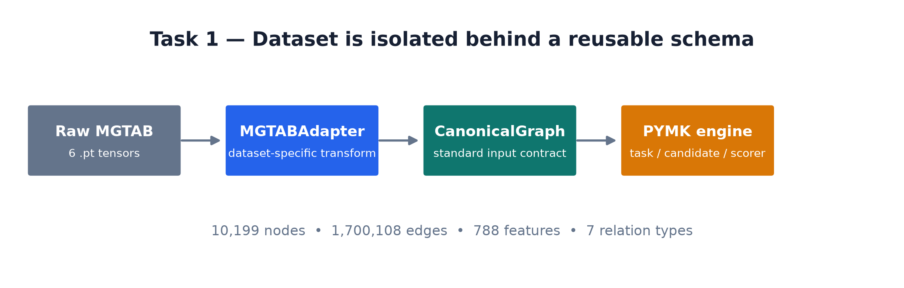
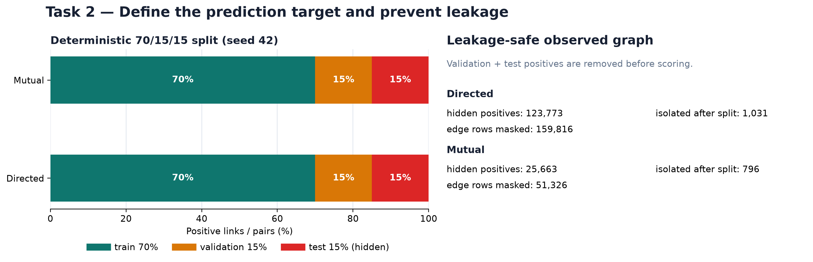
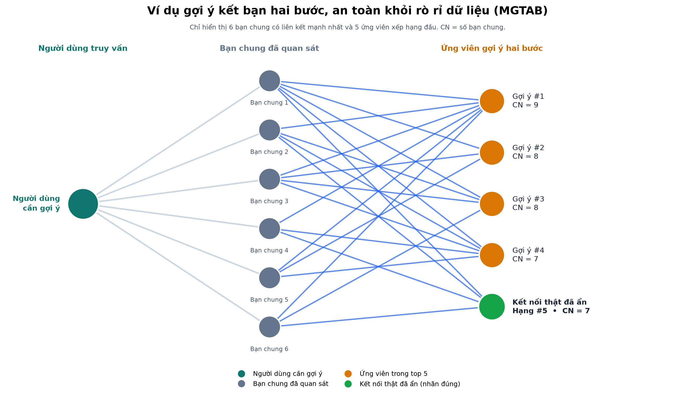
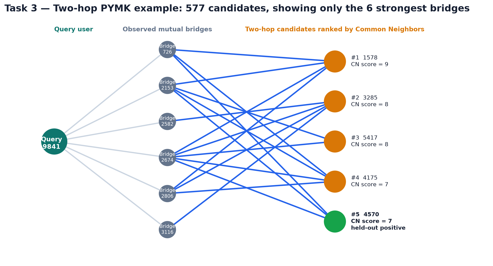
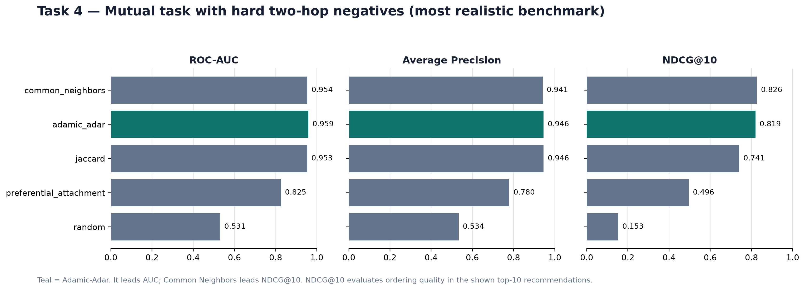

# Báo cáo tiến độ Sprint 1 — Pipeline PYMK trên MGTAB

## 1. Bức tranh tổng thể

Sprint 1 xây dựng và kiểm chứng một pipeline **People You May Know (PYMK)** theo hướng link prediction cổ điển trên dữ liệu MGTAB. Luồng thực nghiệm đi từ dữ liệu raw đến báo cáo metric có thể tái lập như sau:

```text
Raw MGTAB (.pt files)
        |
        v
Task 1: MGTABAdapter -> CanonicalGraph
        |
        v
Task 2: Directed/Mutual task -> leakage-safe observed graph
        |
        v
Task 3: two-hop candidates -> negatives -> topology scorers
        |
        v
Task 4: binary + ranking evaluation -> CSV/report
```

Pipeline **không dùng các nhãn `bot` hoặc `stance` để sinh candidate hay tính điểm liên kết**. Các nhãn này chỉ được giữ trong `CanonicalGraph` cho những task khác trong tương lai. Vì vậy, kết quả Sprint 1 phản ánh tín hiệu topology của social graph, không dùng label làm shortcut.

### Tóm tắt trạng thái Sprint 1

| Hạng mục | Kết quả đã xác nhận |
|---|---|
| Kiểm thử tự động | **21/21 tests passed** trong **7,61 giây** |
| Dataset đã xử lý | MGTAB: 10.199 node, 1.700.108 edge rows, 788 features, 7 relation types |
| Task semantics | Directed connection và Mutual connection proxy |
| Kiểm soát leakage | Split cố định 70%/15%/15%, seed 42; validation/test positives bị mask trước khi score |
| Candidate/ranker | Two-hop candidates; Random, Common Neighbors, Jaccard, Adamic-Adar, Preferential Attachment |
| Benchmark hoàn tất | 2 task × 2 negative modes × 5 scorers = **20 cấu hình**; tổng runtime **32,17 giây** |

> **Phạm vi đánh giá.** Đây là leakage-safe **missing-link/link-reconstruction proxy** trên snapshot MGTAB, không phải bài toán dự đoán quan hệ bạn bè phát sinh trong tương lai theo timestamp và chưa phải một hệ thống production.

### Quy ước chạy lại các artifact

Các lệnh bên dưới được chạy từ thư mục gốc của repository bằng Python trong môi trường `.venv`. Mỗi task ghi rõ lệnh tạo artifact tương ứng; các số liệu trong báo cáo là output của các lệnh đó.

---

## 2. Task 1 — Chuẩn hoá dữ liệu bằng Canonical Schema và MGTAB Adapter

### Mục đích

Raw MGTAB gồm các tensor có định dạng riêng. Mục tiêu Task 1 là cô lập chi tiết riêng của MGTAB trong `MGTABAdapter`, sau đó cung cấp một input contract thống nhất là `CanonicalGraph` cho toàn bộ Task 2–4. Nhờ đó, engine PYMK không phụ thuộc trực tiếp vào tên file hay cấu trúc tensor raw của MGTAB.



*Hình 1. Raw MGTAB được adapter chuyển thành `CanonicalGraph`; các module task, candidate và scorer phía sau chỉ nhận schema chung này.*

### Những thành phần đã tạo

- `CanonicalGraph`: contract chung chứa node IDs, feature matrix, edge index/type/weight, labels và relation schema.
- `DatasetAdapter`: interface để có thể bổ sung dataset mới mà không sửa engine PYMK.
- `MGTABAdapter`: adapter đọc sáu raw tensors MGTAB và ánh xạ relation metadata.
- Validation tổng quát cho `edge_index`, `edge_type`, `edge_weight`, node features, node IDs, labels và relation IDs.

### Mã nguồn, artifact và cách chạy/xác minh

| Vai trò | Vị trí |
|---|---|
| Data contract | [`src/data/canonical_graph.py`](../src/data/canonical_graph.py) |
| Adapter interface | [`src/data/base_adapter.py`](../src/data/base_adapter.py) |
| Schema validation | [`src/data/validation.py`](../src/data/validation.py) |
| Adapter riêng cho MGTAB | [`src/data/adapters/mgtab_adapter.py`](../src/data/adapters/mgtab_adapter.py) |
| Script kiểm chứng | [`scripts/validate_mgtab_adapter.py`](../scripts/validate_mgtab_adapter.py) |
| Hình minh hoạ | [`results/sprint_1_demo/01_task1_schema_pipeline.png`](../results/sprint_1_demo/01_task1_schema_pipeline.png) |

```powershell
# Đọc raw MGTAB, tạo CanonicalGraph và kiểm tra toàn bộ input contract.
.\.venv\Scripts\python.exe scripts\validate_mgtab_adapter.py
```

Lệnh thành công khi terminal in `CanonicalGraph created successfully` và bảy validation checks đều là `[PASS]`.

### Kết quả thực nghiệm

Adapter đã tạo thành công `CanonicalGraph` với các kiểm tra đều đạt:

| Thành phần | Kết quả |
|---|---:|
| Nodes | 10.199 |
| Edge rows | 1.700.108 |
| Node features | 788 |
| Relation types | 7 |
| Validation checks | 7/7 `[PASS]` |

Quan sát từ raw graph: có 205.819 self-loop edge rows và 561.926 duplicate edge rows. Chúng được **phát hiện và báo cáo, không tự ý xoá** ở tầng adapter để bảo toàn raw data; các task downstream có quy tắc xử lý riêng theo semantics của từng bài toán.

### Ý nghĩa

Task 1 tạo nền tảng có thể tái sử dụng: để thay MGTAB bằng dataset khác, chỉ cần hiện thực adapter mới theo `DatasetAdapter`; task semantics, candidate generator, scorer và evaluator không cần thay đổi. Đây cũng là điểm kiểm soát chất lượng đầu vào trước khi diễn giải các metric ở Task 4.

---

## 3. Task 2 — Định nghĩa bài toán và tạo split an toàn khỏi leakage

### Mục đích

Task 2 biến `CanonicalGraph` thành hai cách diễn giải link prediction, đồng thời thiết lập protocol đánh giá để model không nhìn thấy đáp án trước khi dự đoán.

- **Directed connection:** mỗi cạnh có hướng `(u, v)` là một positive riêng; `(u, v)` và `(v, u)` khác nhau.
- **Mutual connection proxy:** một pair chỉ là positive khi relation `friends` xuất hiện ở cả hai chiều; pair được chuẩn hoá thành `(min(u,v), max(u,v))` nên không bị đếm trùng.

Target relation là `friends` (relation ID 1), được resolve từ relation schema thay vì hard-code trong candidate hoặc baseline code. Các interaction relation khác không được đưa vào topology prediction task.



*Hình 2. Positive links/pairs được chia deterministic theo seed 42. Validation và test positives bị loại khỏi observed graph trước khi sinh candidate và score.*

### Những thành phần đã tạo

- `DirectedConnectionTask` và `MutualConnectionTask` để xây dựng positive links/pairs từ `friends`.
- Deterministic split 70% train, 15% validation và 15% test với seed 42.
- `LeakageMasker`(chịu trách nghiệm mask( ẩn đi)các cạnh thuộc tập validation/ test) và `build_observed_graph`(Sau khi mask,hệ thống sẽ xây dựng lại đồ thị quan sát chỉ dựa trên các cạnh train) để mask validation/test positives, bao gồm representation inverse-equivalent của MGTAB khi cần thiết.

- Audit JSON( sau khi split và mask hệ thống sinh ra 1 file json để audit(kiểm tra)) cho task size, split size, số edge rows đã mask và isolated nodes sau split.

### Mã nguồn, artifact và cách chạy/xác minh

| Vai trò | Vị trí |
|---|---|
| Base task và relation resolver | [`src/tasks/base_link_task.py`](../src/tasks/base_link_task.py) |
| Directed task | [`src/tasks/directed_connection.py`](../src/tasks/directed_connection.py) |
| Mutual task | [`src/tasks/mutual_connection.py`](../src/tasks/mutual_connection.py) |
| Task statistics(thống kê task như số note, feature, quan hệ,..) | [`src/tasks/statistics.py`](../src/tasks/statistics.py) |
| Split positive links | [`src/split/link_split.py`](../src/split/link_split.py) |
| Leakage masking(loại bỏ cạnh validation/test khỏi đồ thị tránh leakage) | [`src/split/leakage_mask.py`](../src/split/leakage_mask.py) |
| Tạo task statistics | [`scripts/build_link_task_stats.py`](../scripts/build_link_task_stats.py) |
| Kiểm chứng split/mask | [`scripts/validate_link_split.py`](../scripts/validate_link_split.py) |
| Artifact audit | [`results/task_stats/`](../results/task_stats/) |

```powershell
# Tạo số liệu Directed/Mutual: positive links/pairs, active nodes và graph audit.
.\.venv\Scripts\python.exe scripts\build_link_task_stats.py

# Tạo split audit và xác minh validation/test positives đã bị mask trước khi score.
.\.venv\Scripts\python.exe scripts\validate_link_split.py
```

Hai lệnh ghi `directed_stats.json`, `mutual_stats.json` và `split_stats.json` vào `results/task_stats/`. Lệnh thứ hai là evidence trực tiếp cho số hidden positives, edge rows bị mask và isolated nodes trong bảng bên dưới.

### Kết quả thực nghiệm

| Chỉ số | Directed | Mutual |
|---|---:|---:|
| Positive links/pairs | 412.575 | 85.540 |
| Active nodes | 9.418 | 9.418 |
| Mutual ratio | — | 0,4147 |
| Train positives | 288.802 | 59.877 |
| Validation positives | 61.886 | 12.831 |
| Test positives | 61.887 | 12.832 |
| Hidden positives (validation + test) | 123.773 | 25.663 |
| Edge rows bị mask khỏi observed graph | 159.816 | 51.326 |
| Isolated nodes sau split | 1.031 | 796 |

Số edge rows bị mask cao hơn số hidden pair/link ở một số trường hợp vì leakage mask xử lý cả representation inverse-equivalent của relation MGTAB. Isolated nodes được ghi nhận như kết quả của split, không bị che đi bằng cách điều chỉnh dữ liệu.

### Ý nghĩa

Nếu test edge vẫn tồn tại trong graph khi Common Neighbors hoặc Adamic-Adar tính topology, metric sẽ bị lạc quan giả tạo vì scorer đã nhìn thấy cấu trúc chứa đáp án. Task 2 đảm bảo candidate generation và scoring chỉ sử dụng observed graph đã mask; do đó kết quả Task 3–4 là evidence có kiểm soát leakage.

---

## 4. Task 3 — Sinh candidate hai bước, negative sampling và topology baselines

### Mục đích

Task 3 xây core PYMK cổ điển:

```text
observed graph -> two-hop candidate pool -> negative samples -> topology score -> ranking
```

Với Mutual task, một user có thể nhận candidate qua chuỗi `user — bạn chung — candidate`. Candidate generator loại chính user, các kết nối trực tiếp đã tồn tại và duplicate candidate. Với Directed task, pipeline dùng chiến lược tường minh `out → out`, không tự chuyển directed graph thành undirected graph.

### Những thành phần đã tạo

- `NeighborIndex` và `TwoHopCandidateGenerator` cho candidate pool hai bước.
- Random negatives: pair không nằm trong toàn bộ known positives, bao gồm cả hidden positives; tránh lấy nhầm edge ẩn làm negative.
- Hard negatives: pair thuộc chính two-hop candidate pool, tức giống gợi ý PYMK thật hơn; source không có đủ hard candidate được report thay vì tạo dữ liệu giả.
- Năm scorer topology: Random, Common Neighbors (CN), Jaccard, Adamic-Adar (AA) và Preferential Attachment (PA).

### Mã nguồn, artifact và cách chạy/xác minh

| Vai trò | Vị trí |
|---|---|
| Neighbor index | [`src/candidates/base.py`](../src/candidates/base.py) |
| Two-hop candidate generator | [`src/candidates/two_hop.py`](../src/candidates/two_hop.py) |
| Random/hard negative sampling | [`src/sampling/negative_sampling.py`](../src/sampling/negative_sampling.py) |
| Scorer interface | [`src/baselines/base.py`](../src/baselines/base.py) |
| Common Neighbors | [`src/baselines/common_neighbors.py`](../src/baselines/common_neighbors.py) |
| Jaccard | [`src/baselines/jaccard.py`](../src/baselines/jaccard.py) |
| Adamic-Adar | [`src/baselines/adamic_adar.py`](../src/baselines/adamic_adar.py) |
| Preferential Attachment | [`src/baselines/preferential_attachment.py`](../src/baselines/preferential_attachment.py) |
| Smoke experiment | [`scripts/run_baseline_smoke.py`](../scripts/run_baseline_smoke.py) |
| Tạo hình query/candidate | [`scripts/generate_sprint1_networkx_demo.py`](../scripts/generate_sprint1_networkx_demo.py) |
| Hình Task 3 | [`results/sprint_1_demo/`](../results/sprint_1_demo/) |

```powershell
# Sinh candidate pool và in top-3 Common Neighbors cho một source user ở mỗi task.
.\.venv\Scripts\python.exe scripts\run_baseline_smoke.py

# Sinh hình minh hoạ leakage-safe mutual PYMK cùng JSON metadata truy vết được.
.\.venv\Scripts\python.exe scripts\generate_sprint1_networkx_demo.py
```

Lệnh smoke xác minh candidate generation và scoring chạy cho Directed lẫn Mutual. Lệnh thứ hai tạo `networkx_mutual_pymk_example.png` và `networkx_mutual_pymk_example.json`; hình không thay thế benchmark, chỉ minh hoạ một query thực từ pipeline.

### Kết quả smoke experiment

Smoke experiment trên source user `0` xác nhận candidate generator và Common Neighbors scorer chạy được cho cả hai semantics:

| Task | Số candidate | Top 1 | Top 2 | Top 3 |
|---|---:|---|---|---|
| Directed | 1.228 | Node 4638, CN = 20 | Node 5324, CN = 19 | Node 4132, CN = 18 |
| Mutual | 4.414 | Node 4638, CN = 42 | Node 7308, CN = 41 | Node 5973, CN = 39 |

Kết quả này là smoke evidence cho luồng candidate → score, không phải kết luận benchmark tổng quát. Mutual tạo pool lớn hơn cho source này vì dùng neighborhood vô hướng/reciprocal phù hợp với proxy kết bạn.

### Minh hoạ một recommendation thực tế trong pipeline



*Hình 3. Một ví dụ mutual PYMK từ observed graph. Chỉ sáu bạn chung và năm ứng viên đứng đầu được hiển thị để hình có thể đọc được. CN là số bạn chung.*

Hình 3 minh hoạ query user đi qua các bạn chung đã quan sát để đến ứng viên hai bước. Node xanh lá là **kết nối thật đã bị ẩn** khi đánh giá; pipeline vẫn xếp node này ở **hạng 5** với `CN = 7`. Điều này cho thấy đồ thị không hiển thị một edge đã biết sẵn: test positive đã được mask và chỉ được dùng làm ground truth sau khi ranking.



*Hình 4. Cùng nguyên lý được trình bày theo bố cục ba cột để làm rõ đường đi query → mutual bridges → ranked candidates; ví dụ này có 577 candidate và chỉ hiển thị 6 bridge mạnh nhất.*

### Ý nghĩa

Task 3 chuyển graph topology thành một danh sách PYMK có thể giải thích: mỗi recommendation có đường hai bước qua bạn chung và có điểm xếp hạng cụ thể. Đây là baseline minh bạch để so sánh với các mô hình phức tạp hơn trong sprint sau.

---

## 5. Task 4 — Đánh giá định lượng và so sánh baseline

### Mục đích

Task 4 đánh giá có hệ thống các scorer đã tạo ở Task 3. Matrix thực nghiệm gồm:

| Chiều đánh giá | Các lựa chọn |
|---|---|
| Task | Directed, Mutual |
| Negative mode | Random, Hard two-hop |
| Scorer | Random, Common Neighbors, Jaccard, Adamic-Adar, Preferential Attachment |
| Tổng số cấu hình | **2 × 2 × 5 = 20** |

Protocol cố định seed 42. Benchmark dùng tối đa 100 test positive mỗi task và 30 ranking negatives/query; do đó kết quả có thể tái lập trong thời gian ngắn, đồng thời phải được hiểu là sample benchmark, không phải full-scale production benchmark. Pipeline chạy validation sanity trước test nhưng không dùng validation để chỉnh semantics hay chọn scorer sau khi nhìn test result.

### Mã nguồn, artifact và cách chạy/xác minh

| Vai trò | Vị trí |
|---|---|
| Binary metrics (ROC-AUC, AP) | [`src/evaluation/binary_metrics.py`](../src/evaluation/binary_metrics.py) |
| Ranking metrics | [`src/evaluation/ranking_metrics.py`](../src/evaluation/ranking_metrics.py) |
| Evaluator | [`src/evaluation/evaluator.py`](../src/evaluation/evaluator.py) |
| Report renderer | [`src/evaluation/reporting.py`](../src/evaluation/reporting.py) |
| Benchmark script | [`scripts/run_classical_experiments.py`](../scripts/run_classical_experiments.py) |
| Visualization script | [`scripts/generate_sprint1_visuals.py`](../scripts/generate_sprint1_visuals.py) |
| Kết quả 20 cấu hình | [`results/classical_baselines/results.csv`](../results/classical_baselines/results.csv) |
| Benchmark config | [`results/classical_baselines/config.json`](../results/classical_baselines/config.json) |
| Validation sanity | [`results/classical_baselines/validation_sanity.json`](../results/classical_baselines/validation_sanity.json) |

```powershell
# Chạy validation sanity và toàn bộ 20 cấu hình benchmark; ghi CSV, config và report so sánh.
.\.venv\Scripts\python.exe scripts\run_classical_experiments.py

# Tạo lại các hình Task 1–4 từ artifact benchmark hiện có.
.\.venv\Scripts\python.exe scripts\generate_sprint1_visuals.py
```

Lệnh benchmark in `Saved 20 experiment rows` khi hoàn tất. Lệnh visual chỉ đọc artifact benchmark hiện có để vẽ hình, không thay đổi protocol hay metric.

### Metrics được báo cáo

| Metric | Câu hỏi được trả lời |
|---|---|
| ROC-AUC | Positive có thường được score cao hơn negative không? |
| Average Precision (AP) | Chất lượng precision–recall khi positive/negative mất cân bằng như thế nào? |
| Recall@10 / Hits@10 | Hidden positive có xuất hiện trong top 10 không? |
| NDCG@10 | Thứ tự của các item trong top 10 có tốt không? |
| MRR | Kết nối đúng xuất hiện sớm đến đâu trong ranking? |
| Candidate coverage | Hidden positive có nằm sẵn trong two-hop pool trước khi rank hay không? |

### Kết quả benchmark

`results.csv` đã ghi đủ 20 experiment rows; tổng runtime là **32,17 giây**. Bảng sau tóm tắt scorer tốt nhất theo từng combination (ưu tiên AUC; trường hợp metric khác dẫn đầu được ghi chú):

| Task | Negative mode | Kết quả nổi bật | ROC-AUC | AP | Recall@10 | NDCG@10 | Coverage |
|---|---|---|---:|---:|---:|---:|---:|
| Directed | Random | Common Neighbors | 0,9110 | 0,9150 | 0,9659 | 0,7160 | 0,88 |
| Directed | Hard two-hop | Adamic-Adar (AUC/AP); Jaccard dẫn NDCG@10 = 0,3720 | 0,6927 | 0,6989 | 0,6591 | 0,3706 | 0,88 |
| Mutual | Random | Adamic-Adar | 0,9949 | 0,9946 | 1,0000 | 0,8285 | 1,00 |
| Mutual | Hard two-hop | Adamic-Adar dẫn AUC; Common Neighbors dẫn NDCG@10 | 0,9585 | 0,9459 | 0,9850 | 0,8192 | 1,00 |

Trong thiết lập **Mutual + hard two-hop negatives**, gần với bối cảnh PYMK nhất vì negative cũng là các candidate hai bước, kết quả đầy đủ là:

| Scorer | ROC-AUC | AP | Recall@10 | NDCG@10 | MRR |
|---|---:|---:|---:|---:|---:|
| Random | 0,5306 | 0,5336 | 0,3300 | 0,1529 | 0,1360 |
| Common Neighbors | 0,9543 | 0,9410 | **0,9900** | **0,8261** | **0,7732** |
| Jaccard | 0,9535 | **0,9459** | 0,9500 | 0,7405 | 0,6754 |
| Adamic-Adar | **0,9585** | **0,9459** | 0,9850 | 0,8192 | 0,7656 |
| Preferential Attachment | 0,8254 | 0,7797 | 0,8850 | 0,4956 | 0,3805 |



*Hình 5. So sánh benchmark gần PYMK nhất. Adamic-Adar dẫn ROC-AUC; Common Neighbors dẫn NDCG@10, tức sắp xếp danh sách top 10 tốt nhất trong sample này.*

### Diễn giải kết quả

1. **Hard negatives khó hơn random negatives và đó là kết quả được kỳ vọng.** Random negative thường không có cấu trúc tương tự positive, còn hard negative đã thuộc two-hop pool. Ví dụ Directed + Common Neighbors giảm từ AUC 0,9110 (random) xuống 0,6837 (hard), nhưng đây là benchmark thực tế hơn cho quyết định PYMK.
2. **Mutual là application proxy phù hợp hơn trong Sprint 1.** Candidate coverage của Mutual là 1,00: toàn bộ hidden positives trong sample nằm trong pool trước bước xếp hạng. Directed có coverage 0,88; với phần hidden positive còn lại, bất kỳ ranker topology nào cũng không thể recover nếu chỉ dùng candidate strategy hiện tại.
3. **Chưa có một scorer thắng tuyệt đối.** Adamic-Adar dẫn AUC (0,9585) và đồng dẫn AP (0,9459), trong khi Common Neighbors dẫn NDCG@10 (0,8261), Recall@10 (0,9900) và MRR (0,7732). Nếu sản phẩm ưu tiên chất lượng thứ tự của top-10 recommendation, Common Neighbors là baseline rất cạnh tranh; nếu ưu tiên phân biệt positive/negative toàn cục, Adamic-Adar tốt hơn trong sample này.

---

## 6. Kết luận Sprint 1 và hướng tiếp theo

Sprint 1 đã hoàn thành pipeline PYMK từ raw MGTAB đến benchmark tái lập được, với các bằng chứng chính: adapter validation đạt 7/7 checks, split leakage-safe có audit cụ thể, candidate/ranking smoke test hoạt động cho cả Directed và Mutual, 21/21 unit tests pass và Task 4 tạo đủ 20 benchmark rows.

Kết luận hiện tại là chọn **Mutual connection + hard two-hop negatives** làm application proxy chính để tiếp tục phát triển PYMK. Common Neighbors và Adamic-Adar là hai baseline mạnh cần được giữ làm mốc so sánh.

### Giới hạn cần ghi nhận

- MGTAB được xử lý như snapshot; chưa có temporal future-link ground truth.
- Task 4 dùng sample deterministic (tối đa 100 test positives/task), không phải benchmark toàn bộ test set ở quy mô production.
- Mutual là proxy cho kết nối reciprocal, không khẳng định friendship ngoài đời thực.
- Fraud/trust filtering, feature-based model, PPR/Node2Vec/GNN và API/UI chưa thuộc phạm vi Sprint 1.

### Artifact minh chứng

- [20 dòng kết quả benchmark CSV](../results/classical_baselines/results.csv)
- [Cấu hình benchmark](../results/classical_baselines/config.json)
- [Validation sanity output](../results/classical_baselines/validation_sanity.json)
- [Task statistics và split audit](../results/task_stats/split_stats.json)
